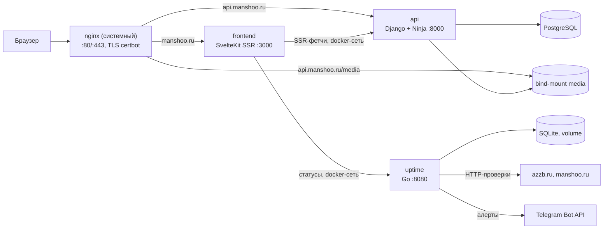

# Архитектура

Обзорный документ. Детали решений и альтернативы — в [decisions/](decisions/).

## Схема (прод)

## Прод-окружение (реальность VPS)

Один сервер на оба проекта: Debian 12, 1 CPU, **1 ГБ RAM** (+2 ГБ swap из bootstrap), 15 ГБ диска, IP 62.109.26.178. Проекты изолированы пользователями: azzb.ru — `azzb_user` (nginx + uWSGI, вне нашего скоупа), manshoo.ru — `manshoo_user`, каталог `/var/www/manshoo`. Системный nginx владеет 80/443 и маршрутизирует оба проекта; наши контейнеры публикуют порты только на 127.0.0.1. Из-за 1 ГБ RAM: gunicorn с 2 воркерами, без лишних сервисов, swap обязателен.

## Сервисы

| Сервис | Стек | Ответственность | Наружу |
|---|---|---|---|
| `frontend` | SvelteKit (Svelte 5, TS), adapter-node | Публичные страницы (SSR), админка `/admin` (CSR, Phase 3), sitemap, robots | manshoo.ru через nginx |
| `api` | Django 5.2 + Ninja, whitenoise | REST API, Django-админка (запасной редактор), медиа | api.manshoo.ru через nginx |
| `uptime` | Go, SQLite | Проверки сайтов, Telegram-алерты, JSON API статусов | **нет** (только docker-сеть/localhost) |
| `postgres` | PostgreSQL 17 | Данные api | нет |

Статику Django (админка) отдаёт **whitenoise** из образа (collectstatic на этапе сборки) — nginx не лазит в контейнер. Медиа-загрузки — bind-mount `/var/www/manshoo/media` ↔ `/app/media`, наружу их отдаёт nginx (`api.manshoo.ru/media/`).

## Маршрутизация

| Адрес | Куда |
|---|---|
| `manshoo.ru`, `www.manshoo.ru` | frontend (SSR) — nginx → 127.0.0.1:3000 |
| `manshoo.ru/admin` | своя админка (Phase 3), CSR + noindex |
| `api.manshoo.ru` | api — nginx → 127.0.0.1:8000 (`/api/*`, `/django-admin/`, OpenAPI-дока `/api/docs`) |
| `api.manshoo.ru/media/*` | nginx напрямую из `/var/www/manshoo/media` |
| `api.manshoo.ru/robots.txt` | `Disallow: /` — API не индексируем |

manshoo.ru и api.manshoo.ru — один registrable domain, т.е. **same-site**: сессионные куки Django будут работать из админки на manshoo.ru без танцев (Phase 3 добавит только CORS-заголовки).

## Деплой (ADR-006)

- **Self-hosted runner** (`manshoo-vps`, label `manshoo`) — systemd-сервис под `manshoo_user`.
- Каждый push в main: workflow сервиса (paths-фильтр) → lint/test на облачном раннере → build+push образа в ghcr → **deploy-job на self-hosted**: sync `docker-compose.prod.yml` (+конфиги) в `/var/www/manshoo` → `docker compose pull/up` → health-check. Для api дополнительно: `migrate` и идемпотентный `createsuperuser`.
- Секреты живут только на VPS: `/var/www/manshoo/api/.env` (генерирует bootstrap), `/var/www/manshoo/uptime/.env` (Telegram, заполняет владелец). В GitHub Secrets ничего класть не нужно.
- **Одноразовый bootstrap** — [deploy/bootstrap-vps.sh](../deploy/bootstrap-vps.sh) под sudo: swap, docker, секреты, runner-сервис, nginx-конфиги, certbot. Идемпотентен.

## Dev-окружение

`docker-compose.yml`: hot-reload у всех (vite/runserver/air, поллинг файлов — inotify не проходит через volume-mount на Windows), postgres с volume, порты 5173/8000/8080/5432. `docker compose up --build` — единственная команда.

## Безопасность

- Сессии Django: HttpOnly, `SameSite=Lax`, `Secure`; CSRF со списком `CSRF_TRUSTED_ORIGINS`; `SECURE_PROXY_SSL_HEADER` — доверяем `X-Forwarded-Proto` от nginx.
- Контейнеры не-root (appuser/nonroot), порты только на localhost, uptime наружу не публикуется.
- Runner = доступ к docker на VPS: чужие PR на self-hosted не выполняются (дефолт GitHub для форков — только с апрувом).
- Загрузки: лимит 10m на nginx, Pillow-пересохранение (Phase 3).

## Бэкапы

- Postgres: `pg_dump` ночным cron'ом на VPS (настроить в Phase 2-деплое, см. roadmap), хранить 14 копий.
- `/var/www/manshoo/media` и SQLite uptime — копия тем же cron'ом.
- Разово проверить восстановление.

## Версии

Python 3.13, Django 5.2 LTS, Node 24 LTS, SvelteKit 2 / Svelte 5, Go 1.26, PostgreSQL 17, nginx системный (Debian), whitenoise, marked. Обновления — Dependabot.
