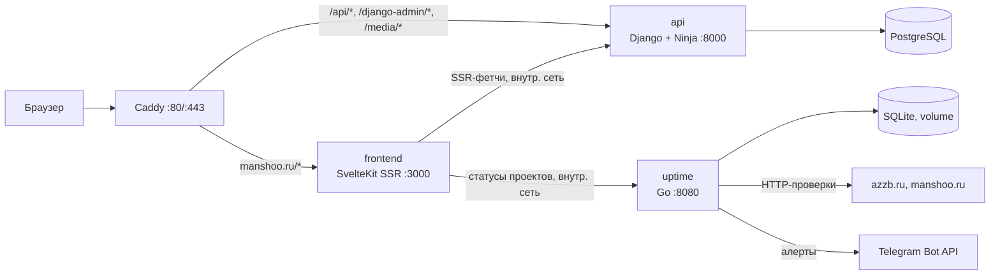

# Архитектура

Обзорный документ. Детали решений и альтернативы — в [decisions/](decisions/).

## Схема

## Сервисы

| Сервис | Стек | Ответственность | Наружу |
|---|---|---|---|
| `frontend` | SvelteKit (Svelte 5, TS), adapter-node | Публичные страницы (SSR/prerender), админка `/admin` (CSR), sitemap, robots | через Caddy |
| `api` | Python, Django + Django Ninja | REST API (профиль, проекты, auth, upload), Django-админка как запасной редактор | только `/api`, `/django-admin`, `/media` |
| `uptime` | Go (stdlib + chi), SQLite | HTTP-проверки сайтов, история, Telegram-алерты, JSON API статусов | **нет** (только внутренняя docker-сеть) |
| `postgres` | PostgreSQL 17 | Данные api | нет |
| `caddy` | Caddy 2 | TLS (auto Let's Encrypt), маршрутизация, отдача `/media` с кэшем | 80/443 |

Ключевое свойство: `uptime` не зависит от сайта и не публикуется наружу. Алерты идут напрямую в Telegram, поэтому канал оповещения работает, даже если веб лежит. Статусы на сайте frontend забирает по внутренней сети (`http://uptime:8080`).

Известное ограничение: чекер на том же VPS, что и manshoo.ru, не заметит падение всего VPS. Компенсация — heartbeat наружу (например, healthchecks.io пингуется самим чекером; пропал пинг — пришёл алерт). Позже чекер можно унести на отдельный бесплатный хост. Подробнее — [05-uptime.md](05-uptime.md).

## Маршрутизация (prod)

| Путь | Куда |
|---|---|
| `manshoo.ru/*` | frontend (SSR) |
| `manshoo.ru/api/*` | api |
| `manshoo.ru/django-admin/*` | api (запасная админка; закрыть доп. basic auth на Caddy) |
| `manshoo.ru/media/*` | volume api, отдаёт Caddy с `Cache-Control` |
| `manshoo.ru/admin/*` | frontend (своя админка, CSR, `noindex`) |

## Окружения

**dev** — `docker-compose.yml`: hot-reload у всех (`vite dev`, `runserver`, `air` для Go), порты наружу, один `.env` на сервис (`.env.example` в git, сами `.env` — нет).

**prod** — `docker-compose.prod.yml`: образы из ghcr.io, `restart: unless-stopped`, healthchecks у каждого сервиса (`/healthz`), volumes: `postgres_data`, `media`, `uptime_data`, `caddy_data`.

Вариант «на VPS уже есть nginx (azzb.ru)»: убираем caddy из compose, публикуем frontend/api на локальные порты и добавляем server-блок в существующий nginx. Решить при первом деплое (открытый вопрос №1 в [00-vision.md](00-vision.md)).

## CI/CD

Три workflow (файлы уже заведены в `.github/workflows/`), каждый с `paths:`-фильтром своего каталога:

1. **PR / push в main**: lint + тесты (frontend: `svelte-check` + eslint + vitest; api: ruff + mypy + pytest; uptime: `go vet` + golangci-lint + `go test`).
2. **push в main**: build multi-stage образа → push в `ghcr.io/manshooo/manshoo.ru-<svc>:latest` + `:sha`.
3. **deploy job**: по ssh на VPS → `docker compose pull <svc> && docker compose up -d <svc>`. Секреты — в GitHub Secrets.

## Безопасность

- Auth админки: сессии Django (HttpOnly cookie, `SameSite=Lax`) + CSRF; один суперюзер; rate limit на login.
- `/django-admin` дополнительно за basic auth на прокси.
- Секреты только через env; `DEBUG=0` в prod; `ALLOWED_HOSTS`/`CSRF_TRUSTED_ORIGINS` заданы явно.
- Загрузка изображений: лимит размера, проверка content-type, имена файлов нормализуются.

## Бэкапы

- Postgres: `pg_dump` ночью по cron на VPS, хранить 14 копий, выгрузка в объектное хранилище/другую машину — позже.
- `media` и SQLite uptime: rsync/copy тем же кроном.
- Проверка восстановления — один раз при настройке (см. roadmap Phase 2).

## Версии (зафиксировать при старте фазы)

Python 3.13, Django 5.2 LTS, Node 22 LTS, SvelteKit 2 / Svelte 5, Go 1.26 (air требует ≥1.26), PostgreSQL 17. Обновления — Dependabot (настроен в Phase 0).
